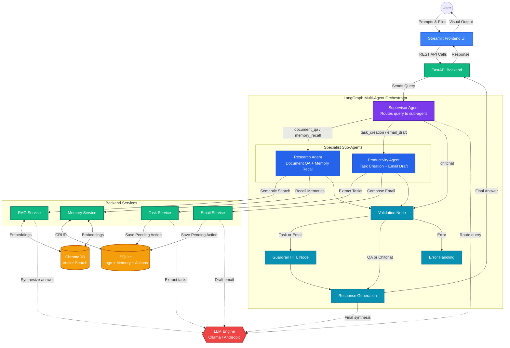
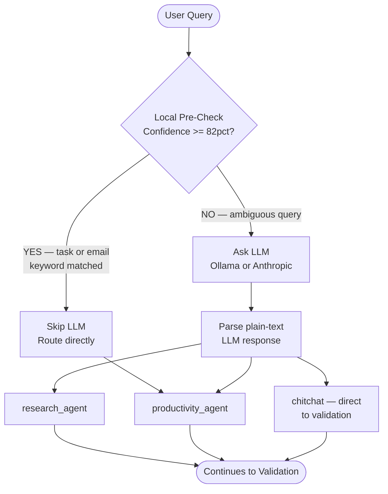
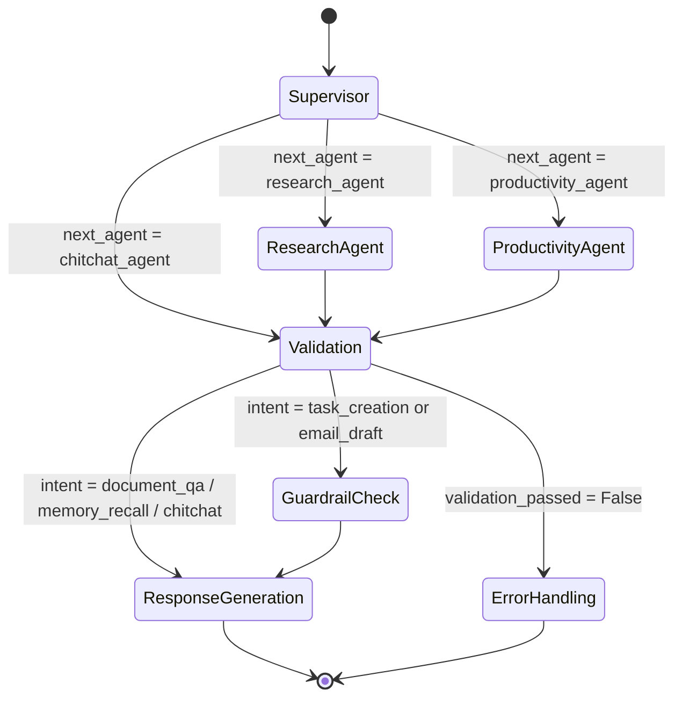
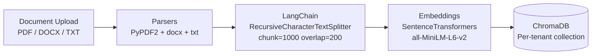
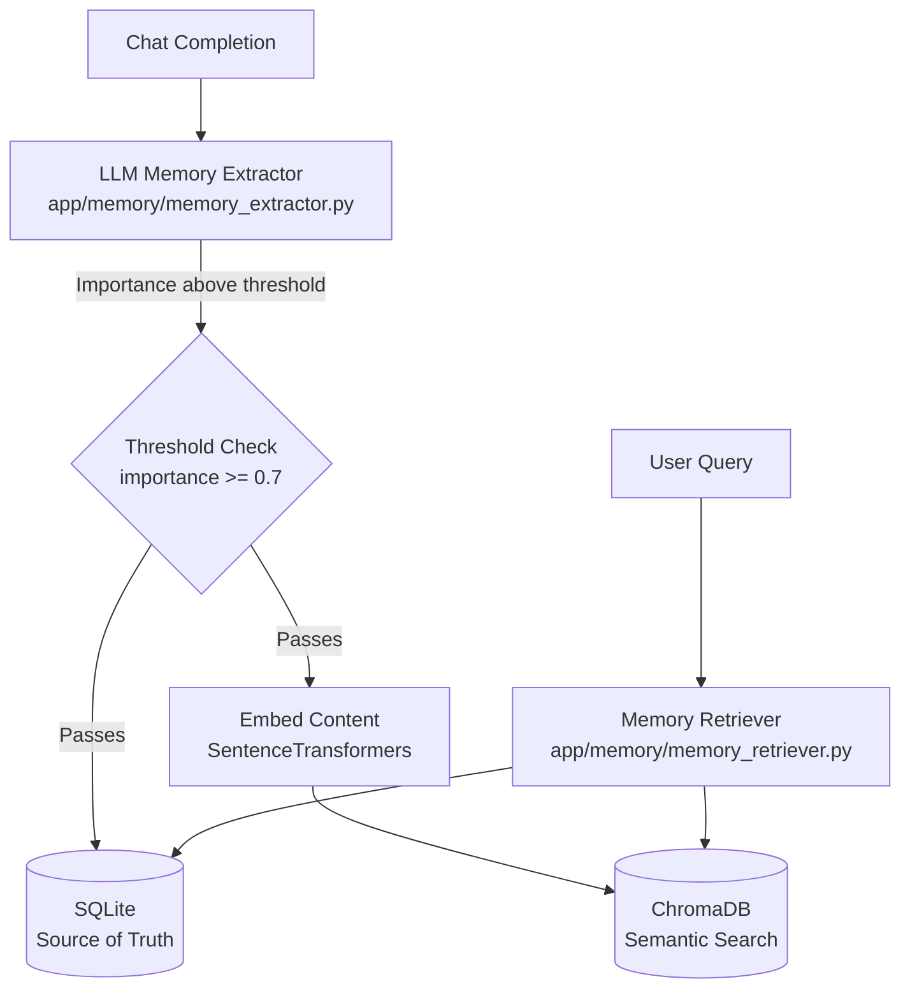
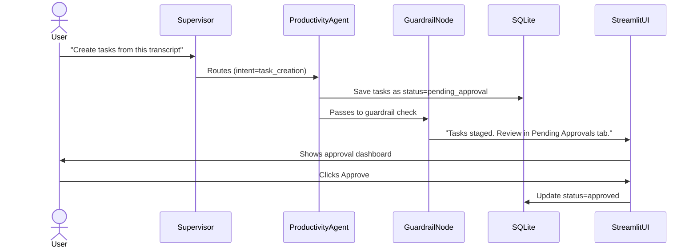
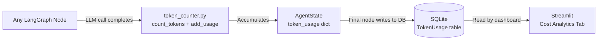

# WorkMate Architecture Diagrams

> **Updated:** Reflects the new Multi-Agent Supervisor architecture (v2).

---

## 1. Full System Architecture

The top-level view of the entire WorkMate system — from the user typing a message
all the way through the multi-agent backend and back to the UI.



---

## 2. Multi-Agent Supervisor Decision Flow

How the Supervisor decides which sub-agent handles the request,
using a two-layer routing strategy.



---

## 3. LangGraph State Machine (Full Node Graph)

The exact nodes and edges registered in `app/agent/graph.py`.



---

## 4. Document Processing Pipeline (RAG Ingestion)

How uploaded documents are processed and stored for semantic search.



---

## 5. Memory System Architecture

How WorkMate builds and retrieves long-term memory across conversations.



---

## 6. Human-In-The-Loop (HITL) Safety Flow

How WorkMate safely stages dangerous actions for human approval
instead of executing them autonomously.



---

## 7. Observability & Cost Tracking

How token usage is tracked across every LLM call in the pipeline.



---

## 8. File Structure Map

```
workmate/
├── app/
│   ├── agent/
│   │   ├── graph.py            ← LangGraph wiring (Supervisor entry point)
│   │   ├── state.py            ← AgentState shared across all nodes
│   │   ├── supervisor.py       ← NEW: Supervisor routing agent
│   │   ├── nodes.py            ← Shared nodes (validation, response, error)
│   │   ├── llm_factory.py      ← Returns Anthropic or Ollama client
│   │   ├── local_llm.py        ← Rule-based fallback engine
│   │   ├── prompts.py          ← Prompt templates
│   │   └── subagents/
│   │       ├── research_agent.py     ← NEW: RAG + Memory sub-agent
│   │       └── productivity_agent.py ← NEW: Tasks + Email sub-agent
│   ├── db/                     ← SQLAlchemy models + session + init
│   ├── ingestion/              ← Document loaders, chunker, embedder
│   ├── memory/                 ← Memory extractor, retriever, store
│   ├── observability/
│   │   ├── tracing.py          ← @trace_node decorator
│   │   └── token_counter.py    ← NEW: Token usage + cost tracking
│   ├── rag/                    ← RAG service (search_documents)
│   ├── safety/                 ← Guardrails + HITL action logging
│   ├── tasks/                  ← Task extraction service
│   ├── email/                  ← Email drafting service
│   └── main.py                 ← FastAPI app + all API routes
├── frontend/
│   └── streamlit_app.py        ← Full UI (chat, uploads, approvals, analytics)
├── tests/
│   ├── test_agent.py           ← Graph init test
│   ├── test_chunker.py         ← Text splitter tests
│   ├── test_memory.py          ← Memory CRUD tests
│   ├── test_supervisor.py      ← NEW: 15 supervisor routing tests
│   └── eval_agent.py           ← Routing accuracy evaluation (6/6 = 100%)
├── data/
│   ├── chroma/                 ← Local ChromaDB storage
│   └── uploads/                ← Uploaded document staging
├── ARCHITECTURE.md             ← This file
├── DESIGN_DOC.md               ← Architectural decisions & trade-offs
├── README.md                   ← Setup + feature overview
└── requirements.txt            ← Python dependencies
```
