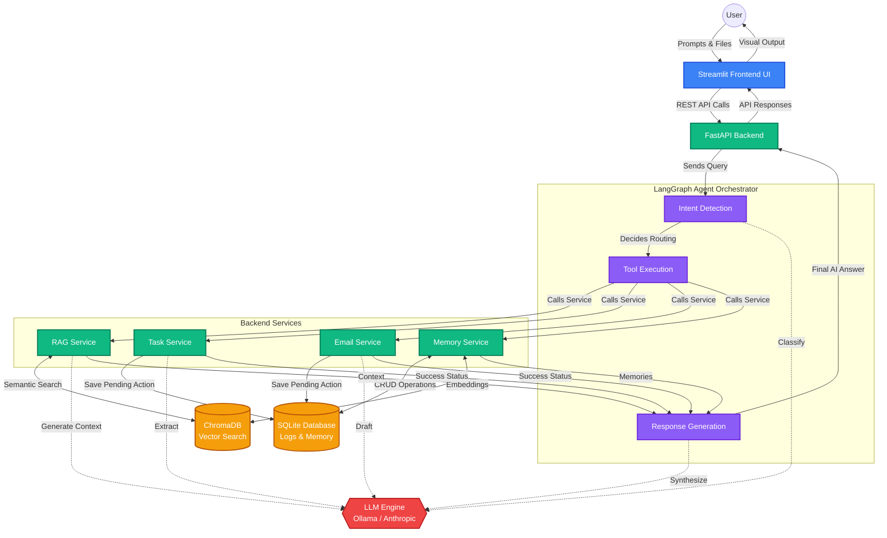
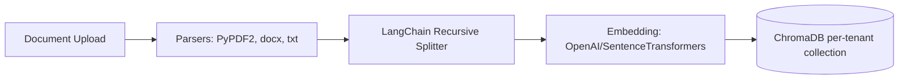
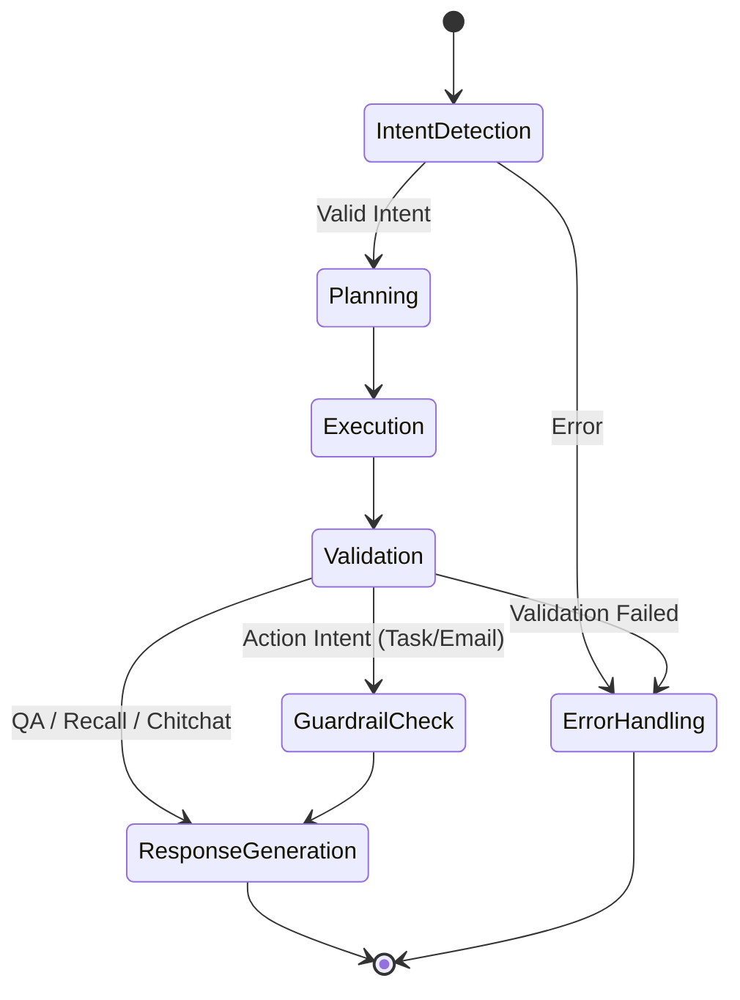
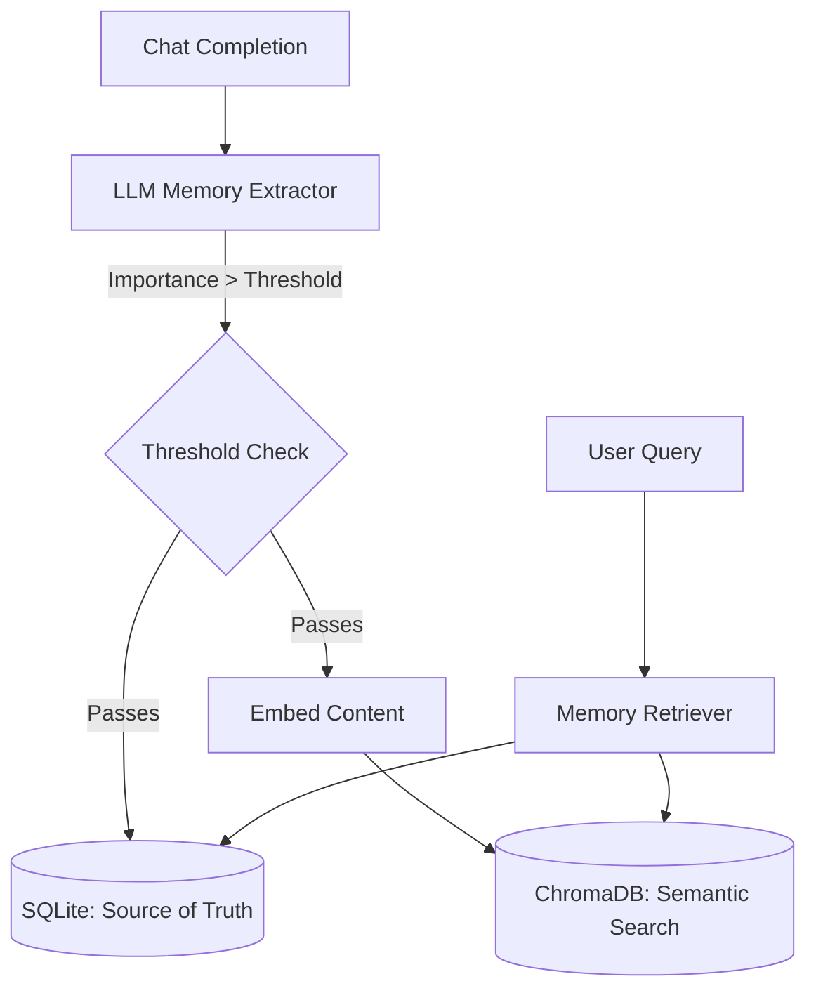

# WorkMate Architecture Diagrams

## 1. Full System Architecture

```mermaid
graph TD
    %% Define Styles
    classDef frontend fill:#3b82f6,stroke:#1d4ed8,stroke-width:2px,color:#fff
    classDef backend fill:#10b981,stroke:#047857,stroke-width:2px,color:#fff
    classDef agent fill:#8b5cf6,stroke:#6d28d9,stroke-width:2px,color:#fff
    classDef db fill:#f59e0b,stroke:#b45309,stroke-width:2px,color:#fff
    classDef llm fill:#ef4444,stroke:#b91c1c,stroke-width:2px,color:#fff

    %% Components
    User((User))
    UI[Streamlit Frontend UI]:::frontend
    API[FastAPI Backend]:::backend
    
    %% LangGraph Orchestrator
    subgraph "LangGraph Agent Orchestrator"
        Intent[Intent Detection]:::agent
        Execution[Tool Execution]:::agent
        Response[Response Generation]:::agent
    end
    
    %% Services
    subgraph "Backend Services"
        RAG[RAG Service]:::backend
        TaskServ[Task Service]:::backend
        EmailServ[Email Service]:::backend
        MemServ[Memory Service]:::backend
    end
    
    %% Data & Models
    SQLite[(SQLite Database\nLogs & Memory)]:::db
    Chroma[(ChromaDB\nVector Search)]:::db
    LLM{{LLM Engine\nOllama / Anthropic}}:::llm

    %% Forward Connections
    User -->|Prompts & Files| UI
    UI -->|REST API Calls| API
    
    API -->|Sends Query| Intent
    Intent -->|Decides Routing| Execution
    Execution -->|Calls Service| RAG
    Execution -->|Calls Service| TaskServ
    Execution -->|Calls Service| EmailServ
    Execution -->|Calls Service| MemServ
    
    %% Service DB interactions
    RAG <-->|Semantic Search| Chroma
    MemServ <-->|CRUD Operations| SQLite
    TaskServ -->|Save Pending Action| SQLite
    EmailServ -->|Save Pending Action| SQLite
    MemServ <-->|Embeddings| Chroma
    
    %% LLM Interactions
    RAG -.->|Generate Context| LLM
    TaskServ -.->|Extract| LLM
    EmailServ -.->|Draft| LLM
    Intent -.->|Classify| LLM
    Response -.->|Synthesize| LLM
    
    %% Return flow back up to User
    RAG -->|Context| Response
    MemServ -->|Memories| Response
    TaskServ -->|Success Status| Response
    EmailServ -->|Success Status| Response
    
    Response -->|Final AI Answer| API
    API -->|API Responses| UI
    UI -->|Visual Output| User
```

## 2. Document Processing Pipeline

```mermaid
graph LR
    Upload[Document Upload] --> Parsers[Parsers: PyPDF2, docx, txt]
    Parsers --> Chunker[LangChain Recursive Splitter]
    Chunker --> Embedder[Embedding: OpenAI/SentenceTransformers]
    Embedder --> Chroma[(ChromaDB per-tenant collection)]
```

## 3. Agent Architecture (LangGraph)

```mermaid
stateDiagram-v2
    [*] --> IntentDetection
    IntentDetection --> Planning : Valid Intent
    IntentDetection --> ErrorHandling : Error
    Planning --> Execution
    Execution --> Validation
    Validation --> ErrorHandling : Validation Failed
    Validation --> GuardrailCheck : Action Intent (Task/Email)
    Validation --> ResponseGeneration : QA / Recall / Chitchat
    GuardrailCheck --> ResponseGeneration
    ResponseGeneration --> [*]
    ErrorHandling --> [*]
```

## 4. Memory System Architecture

```mermaid
graph TD
    Chat[Chat Completion] --> Extractor[LLM Memory Extractor]
    Extractor -->|Importance > Threshold| Router{Threshold Check}
    Router -->|Passes| SQLite[(SQLite: Source of Truth)]
    Router -->|Passes| Embedder[Embed Content]
    Embedder --> Chroma[(ChromaDB: Semantic Search)]
    
    Query[User Query] --> Retriever[Memory Retriever]
    Retriever --> Chroma
    Retriever --> SQLite
```
