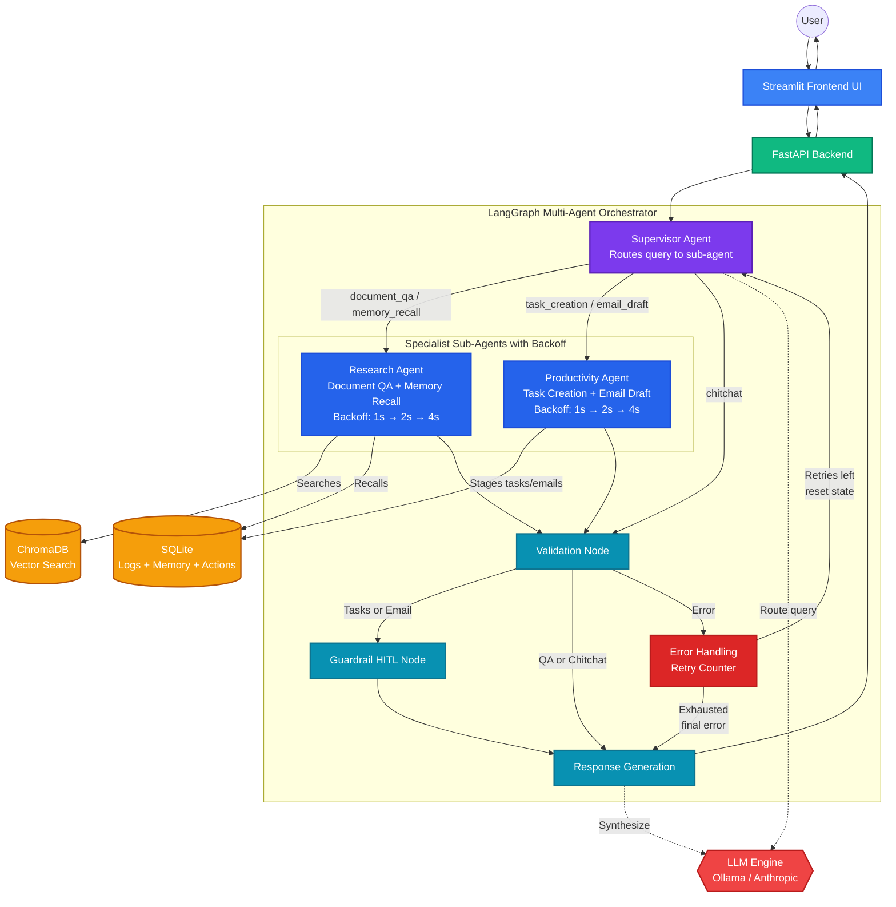
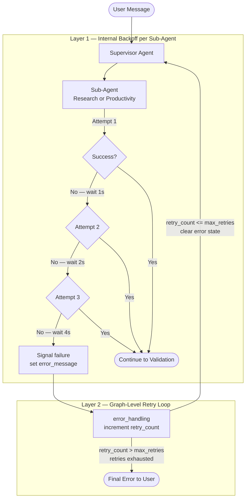
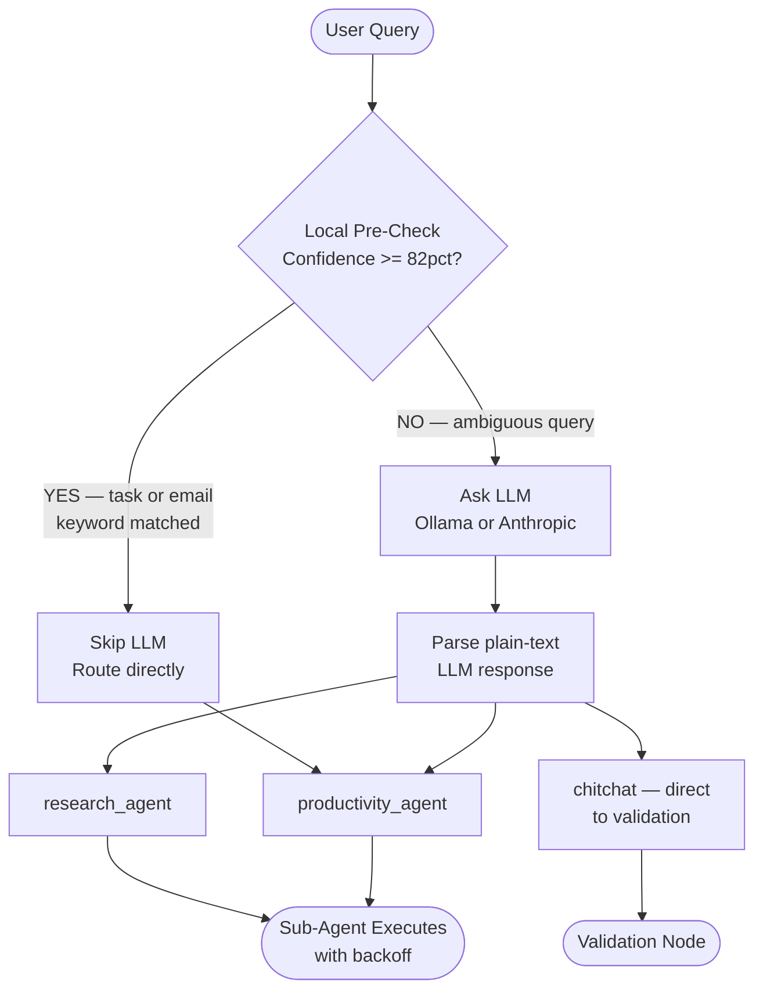
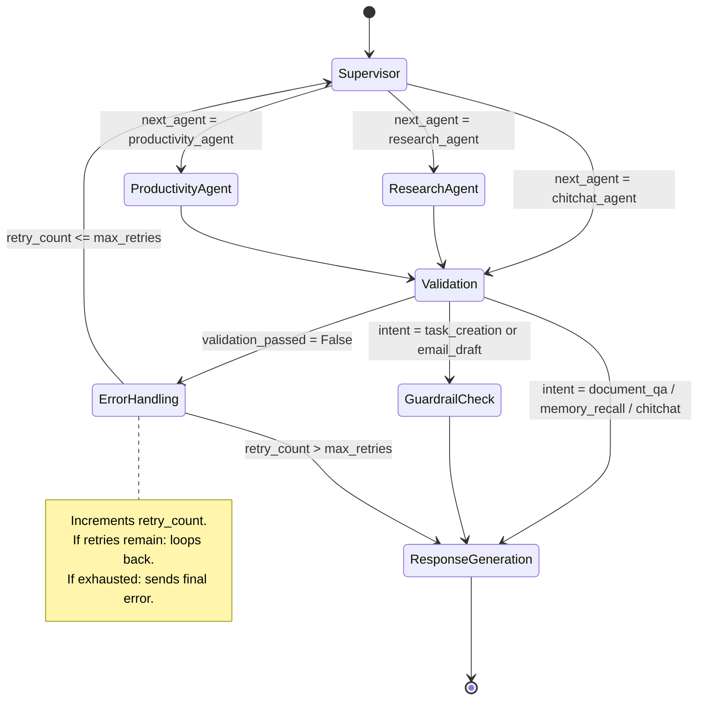
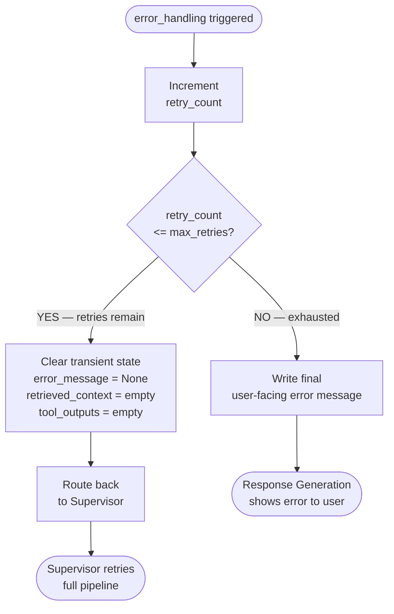
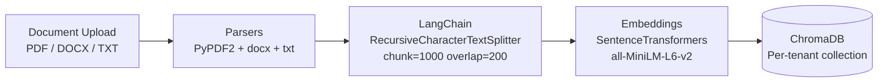
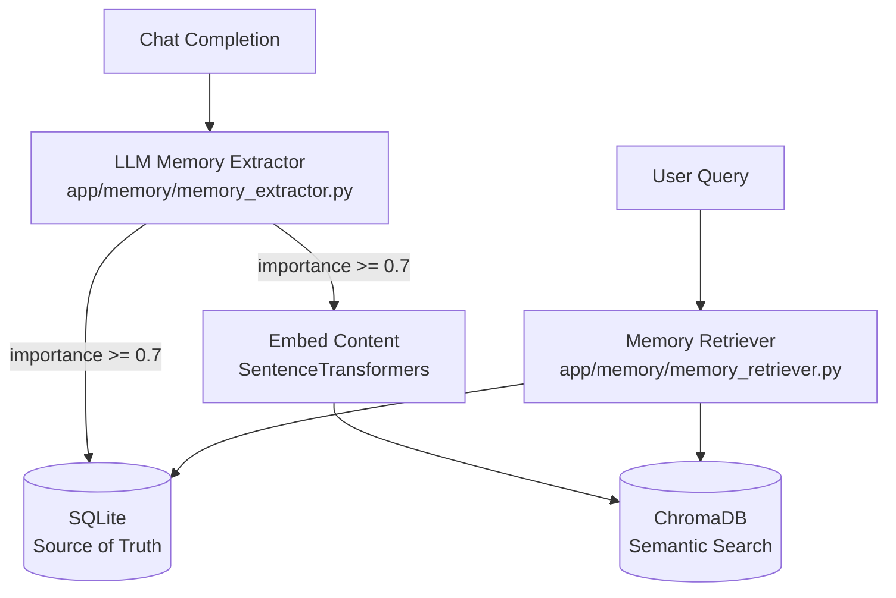
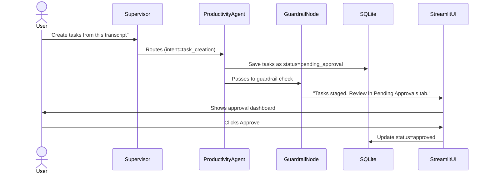
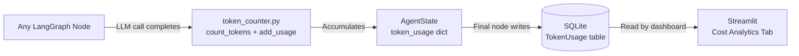

# WorkMate Architecture Diagrams

> **v3 — Updated:** Now includes fault-tolerant retry loop with exponential backoff.

---

## 1. Full System Architecture



---

## 2. Fault-Tolerant Retry Architecture

The system has **two independent layers** of fault tolerance to handle any transient failure.



---

## 3. Multi-Agent Supervisor Decision Flow

How the Supervisor decides which sub-agent handles the request —
using a two-layer routing strategy.



---

## 4. LangGraph State Machine (Full Node Graph)

The exact nodes and edges registered in `app/agent/graph.py`.



---

## 5. Error State Machine

Exactly what happens inside `error_handling` every time it is triggered.



---

## 6. Document Processing Pipeline

How uploaded documents are processed and stored for semantic search.



---

## 7. Memory System Architecture

How WorkMate builds and retrieves long-term memory across conversations.



---

## 8. Human-In-The-Loop Safety Flow

How WorkMate safely stages dangerous actions for human approval.



---

## 9. Observability and Cost Tracking

How token usage is tracked across every LLM call.



---

## 10. File Structure Map

```
workmate/
├── app/
│   ├── agent/
│   │   ├── graph.py            ← LangGraph wiring + retry conditional edge
│   │   ├── state.py            ← AgentState (retry_count, max_retries added)
│   │   ├── supervisor.py       ← Supervisor routing agent
│   │   ├── nodes.py            ← Shared nodes (error_handling has retry logic)
│   │   ├── llm_factory.py      ← Returns Anthropic or Ollama client
│   │   ├── local_llm.py        ← Rule-based fallback engine
│   │   ├── prompts.py          ← Prompt templates
│   │   └── subagents/
│   │       ├── research_agent.py     ← RAG + Memory with exponential backoff
│   │       └── productivity_agent.py ← Tasks + Email with exponential backoff
│   ├── db/                     ← SQLAlchemy models + session + init
│   ├── ingestion/              ← Document loaders, chunker, embedder
│   ├── memory/                 ← Memory extractor, retriever, store
│   ├── observability/
│   │   ├── tracing.py          ← @trace_node decorator
│   │   └── token_counter.py    ← Token usage + cost tracking
│   ├── rag/                    ← RAG service (search_documents)
│   ├── safety/                 ← Guardrails + HITL action logging
│   ├── tasks/                  ← Task extraction service
│   ├── email/                  ← Email drafting service
│   └── main.py                 ← FastAPI app + all API routes
├── frontend/
│   └── streamlit_app.py        ← Full UI (chat, uploads, approvals, analytics)
├── tests/
│   ├── test_agent.py           ← Graph init test
│   ├── test_chunker.py         ← Text splitter tests
│   ├── test_memory.py          ← Memory CRUD tests
│   ├── test_supervisor.py      ← 15 supervisor routing tests
│   └── eval_agent.py           ← Routing accuracy eval (6/6 = 100%)
├── ARCHITECTURE.md             ← This file (10 diagrams)
├── DESIGN_DOC.md               ← Architectural decisions and trade-offs
├── README.md                   ← Setup + feature overview
└── requirements.txt            ← Python dependencies
```

---

## Summary: What Makes This Production-Grade

| Feature | Implementation |
|---|---|
| **Multi-Agent Routing** | Supervisor with LLM + local pre-check |
| **Specialist Sub-Agents** | Research Agent + Productivity Agent |
| **Internal Backoff** | 3 attempts per tool call: 1s → 2s → 4s |
| **Graph-Level Retry** | error_handling loops back to Supervisor (max 3x) |
| **Graceful Degradation** | RAG failure falls back to raw query, not hard crash |
| **Human-In-The-Loop** | All actions staged for approval before execution |
| **Long-Term Memory** | Dual storage: SQLite (relational) + ChromaDB (semantic) |
| **Observability** | Token counting on every LLM call |
| **Test Coverage** | 25/25 tests passing, 100% supervisor routing accuracy |
