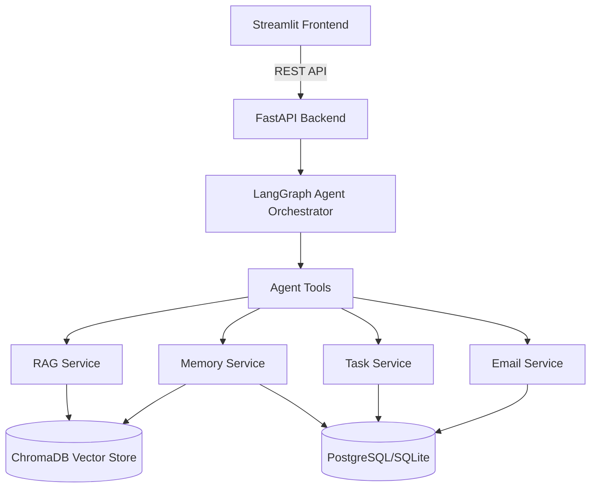
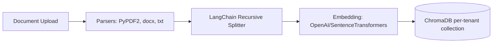
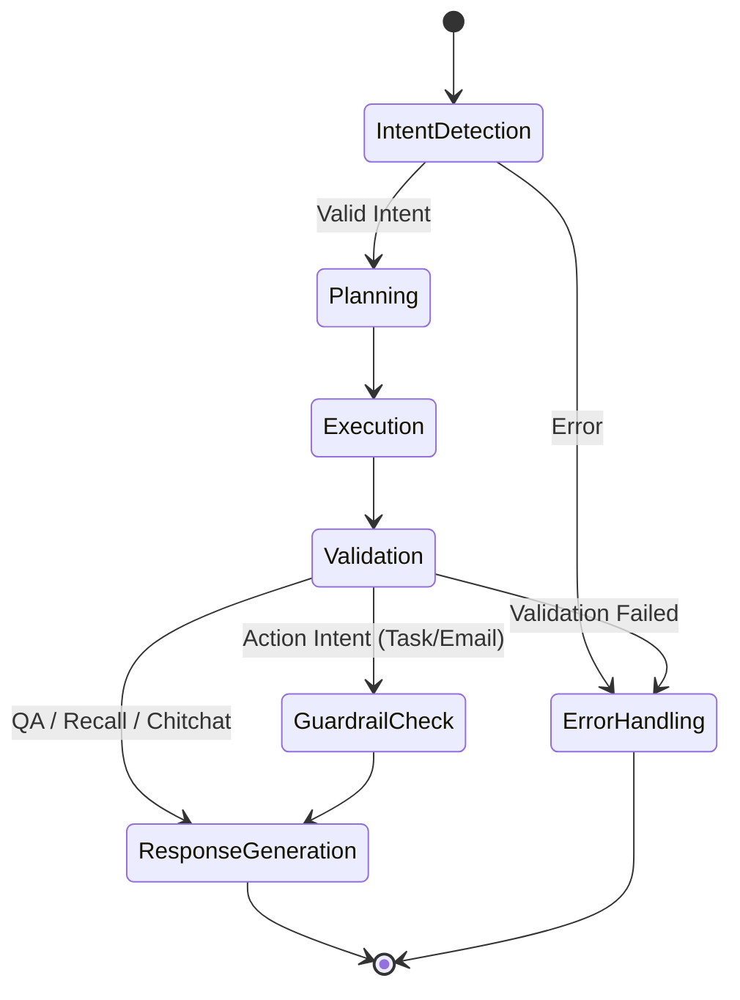
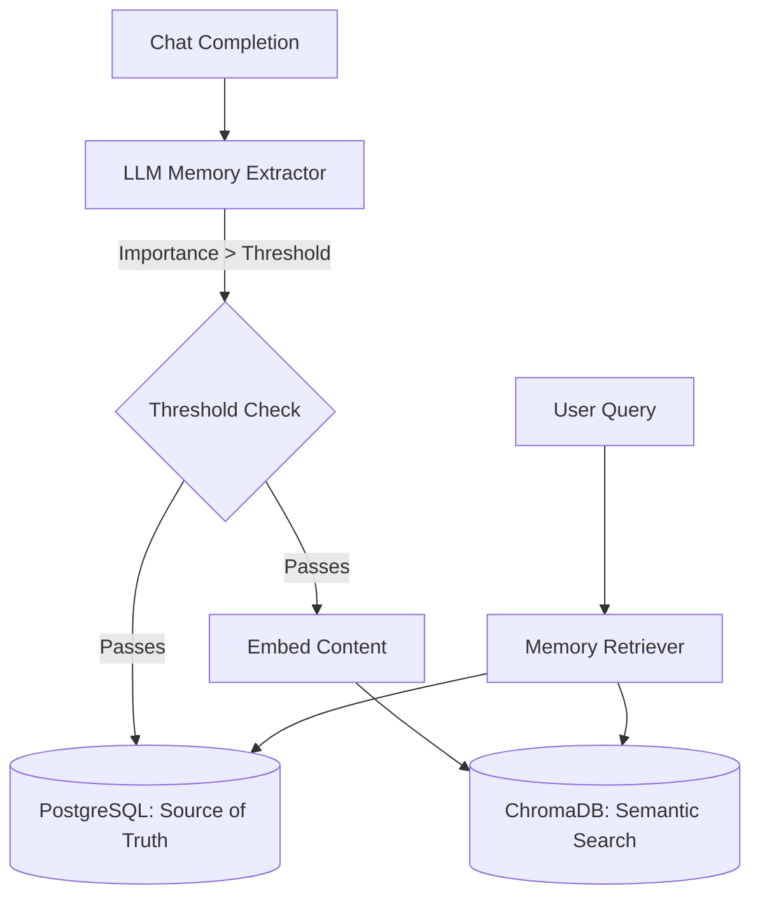

# WorkMate: AI Workspace Assistant Prototype

WorkMate is a production-quality, scoped prototype for an AI Workspace Assistant. It features multi-tenancy, permission-aware RAG, an advanced memory system, task generation, email drafting, Human-in-the-Loop (HITL) safety mechanisms, and LangGraph-based agent orchestration.

## Architectures

### 1. High-Level Architecture


### 2. Document Processing Pipeline


### 3. Agent Architecture (LangGraph)


### 4. Memory System Architecture


## Setup Instructions

1. **Clone and Setup Virtual Environment:**
   ```bash
   python -m venv venv
   source venv/bin/activate  # On Windows: venv\Scripts\activate
   pip install -r requirements.txt
   ```

2. **Environment Variables:**
   ```bash
   cp .env.example .env
   # Edit .env and add your ANTHROPIC_API_KEY
   ```

3. **Initialize Database:**
   ```bash
   python -m app.db.init_db
   ```

4. **Run Backend (FastAPI):**
   ```bash
   uvicorn app.main:app --reload
   ```

5. **Run Frontend (Streamlit):**
   ```bash
   # In a new terminal
   streamlit run frontend/streamlit_app.py
   ```

## Assumptions
- Uses SQLite as the default relational DB for ease of local setup; configurable to Postgres via `DB_URL`.
- Local embeddings (`sentence-transformers/all-MiniLM-L6-v2`) are used by default to save API costs.
- The user uses a single tenant for testing the prototype UI, though the backend supports multiple tenants.
- All documents uploaded through the UI without an explicit user selection are considered tenant-shared (`user_id = None`).
- Email drafting simply logs to the ActionLog for HITL and marks as executed without using an actual SMTP server.

## Known Limitations
- Background task queues (Celery/RQ) are currently stubbed using FastAPI `BackgroundTasks`. For production, a dedicated worker process is recommended.
- The `user_id` is passed as a simple parameter; in production, this would be extracted from a verified JWT token.
- Document parsing is basic; complex PDFs with multi-column layouts might lose structural fidelity.

## Bonus Features Mapping
- **Full Long-Term Memory:** Implemented via `app/memory/`. Dual storage in Chroma (semantic) and SQLite/Postgres (relational, tracking `last_accessed_at` and importance).
- **Human-In-The-Loop (Safety):** Implemented via `app/safety/guardrails.py` and the "Pending Approvals" Streamlit tab. Actions like `create_tasks` and `draft_email` generate `pending_approval` entries in the `ActionLog` table.
- **Permission-Aware Retrieval:** All database models enforce `tenant_id` isolation. Chroma collections are created per-tenant (e.g., `tenant_{tenant_id}_docs`), and queries are filtered by `user_id`.
- **Observability:** Wrapped LangGraph nodes using `@trace_node` in `app/observability/tracing.py`. Results are viewable in the "Agent Trace (Debug)" tab in Streamlit.
