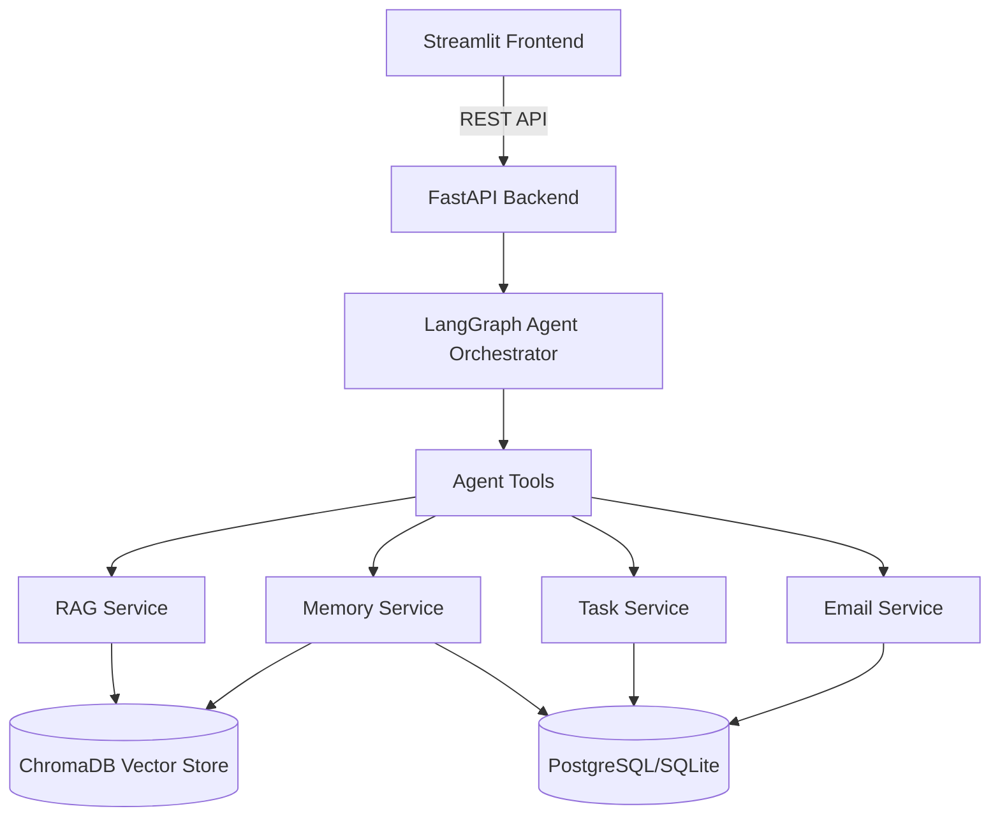
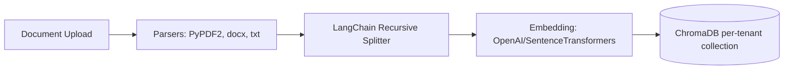
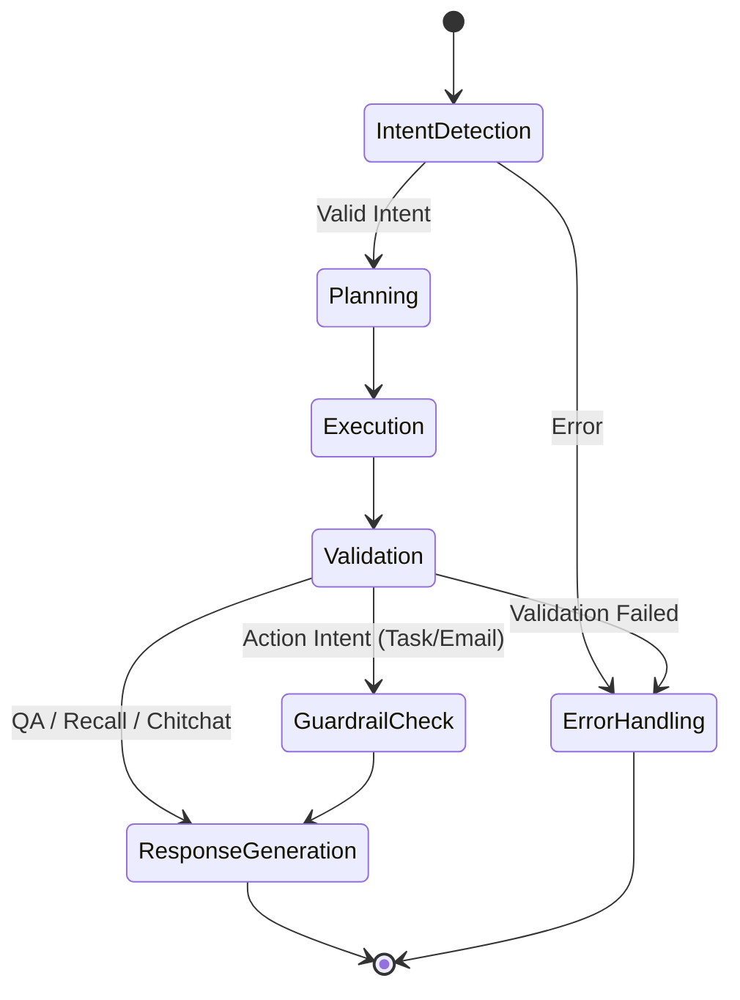
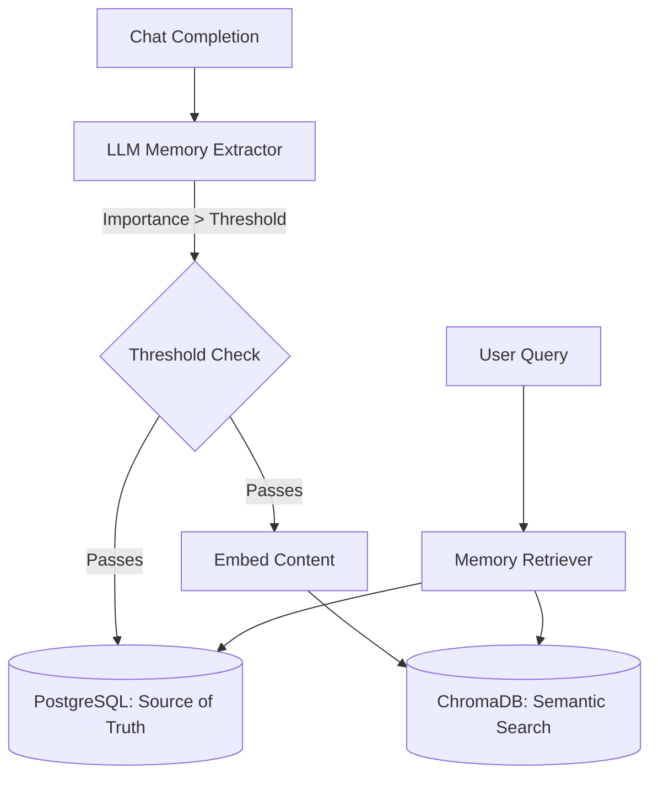

# WorkMate: AI Workspace Assistant Prototype

WorkMate is a production-quality, scoped prototype for an AI Workspace Assistant. It features multi-tenancy, permission-aware RAG, an advanced memory system, task generation, email drafting, Human-in-the-Loop (HITL) safety mechanisms, and LangGraph-based agent orchestration.

## Architectures

### 1. High-Level Architecture


### 2. Document Processing Pipeline


### 3. Agent Architecture (LangGraph)


### 4. Memory System Architecture


## Setup Instructions

1. **Clone and Setup Virtual Environment:**
   ```bash
   python -m venv venv
   source venv/bin/activate  # On Windows: venv\Scripts\activate
   pip install -r requirements.txt
   ```

2. **Environment Variables:**
   ```bash
   cp .env.example .env
   # Edit .env and add your ANTHROPIC_API_KEY
   ```

3. **Initialize Database:**
   ```bash
   python -m app.db.init_db
   ```

4. **Run Backend (FastAPI):**
   ```bash
   uvicorn app.main:app --reload
   ```

5. **Run Frontend (Streamlit):**
   ```bash
   # In a new terminal
   streamlit run frontend/streamlit_app.py
   ```

## Assumptions
- Uses SQLite as the default relational DB for ease of local setup; configurable to Postgres via `DB_URL`.
- Local embeddings (`sentence-transformers/all-MiniLM-L6-v2`) are used by default to save API costs.
- The user uses a single tenant for testing the prototype UI, though the backend supports multiple tenants.
- All documents uploaded through the UI without an explicit user selection are considered tenant-shared (`user_id = None`).
- Email drafting simply logs to the ActionLog for HITL and marks as executed without using an actual SMTP server.

## Known Limitations
- Background task queues (Celery/RQ) are currently stubbed using FastAPI `BackgroundTasks`. For production, a dedicated worker process is recommended.
- The `user_id` is passed as a simple parameter; in production, this would be extracted from a verified JWT token.
- Document parsing is basic; complex PDFs with multi-column layouts might lose structural fidelity.

## Bonus Features Mapping
- **Full Long-Term Memory:** Implemented via `app/memory/`. Dual storage in Chroma (semantic) and SQLite/Postgres (relational, tracking `last_accessed_at` and importance).
- **Human-In-The-Loop (Safety):** Implemented via `app/safety/guardrails.py` and the "Pending Approvals" Streamlit tab. Actions like `create_tasks` and `draft_email` generate `pending_approval` entries in the `ActionLog` table.
- **Observability:** Wrapped LangGraph nodes using `@trace_node` in `app/observability/tracing.py`. Results are viewable in the "Agent Trace (Debug)" tab in Streamlit.

## Part 5: Product Thinking

### Question 1: Why do most AI workplace assistants fail?
Most AI workplace assistants fail due to a combination of three factors:
1.  **Lack of Deep Context:** They act as generic conversationalists but don't have access to the user's specific files, past decisions, or operating context. They suffer from amnesia.
2.  **The "Blank Canvas" Problem:** Users are presented with a chat box but aren't sure what to ask or what the AI is capable of. It requires too much prompt engineering from the user.
3.  **Lack of Agency + Trust Issues:** Assistants that only talk are essentially just advanced search engines. Assistants that take actions autonomously (scary) lead to a loss of trust due to hallucinations. WorkMate solves this by acting on specific local context (RAG) and implementing a Human-in-the-Loop (HITL) approval system for all actions.

### Question 2: Differentiation
How WorkMate differs from:
*   **ChatGPT / Claude:** These are generic, cloud-only platforms. They pose significant data privacy risks for corporate data. They also typically do not persist memory across sessions automatically, and they cannot take tangible actions (like staging an email draft or Jira ticket) natively with an approval dashboard.
*   **Notion AI:** Notion AI is brilliant but siloed. It only works within the Notion ecosystem. It cannot read your local PDFs, draft emails for your Outlook client, or act as a general operating system layer.
*   **WorkMate:** It is built to be a **privacy-first, local-first** assistant. It brings the AI to *your* workspace files, maintains long-term memory across all interactions, and safely stages actions for your approval rather than doing them silently.

### Question 3: If given three additional months, what would you build next and why?
1.  **Month 1: True Integrations (Execution Layer).** Currently, actions (emails, tasks) are saved as "Pending" in the database. I would integrate the Gmail/Outlook APIs and Jira/Linear APIs so that clicking "Approve" actually executes the action in the real world. *Why: This bridges the gap between AI generation and actual workplace productivity.*
2.  **Month 2: Proactive / Background Agents.** Move beyond a strictly chat-based interface. Have the agent run in the background, monitor a specific folder for new documents, or monitor an inbox, and proactively suggest tasks or drafts without the user needing to ask. *Why: The best assistants don't wait to be told what to do; they anticipate needs.*
3.  **Month 3: Desktop Native App (Electron/Tauri).** Migrate the frontend from Streamlit to a native desktop application. *Why: This allows the AI to hook deeply into the OS—reading the active window, capturing screen context, and managing local files much faster, turning it into a true "Workspace" assistant.*
